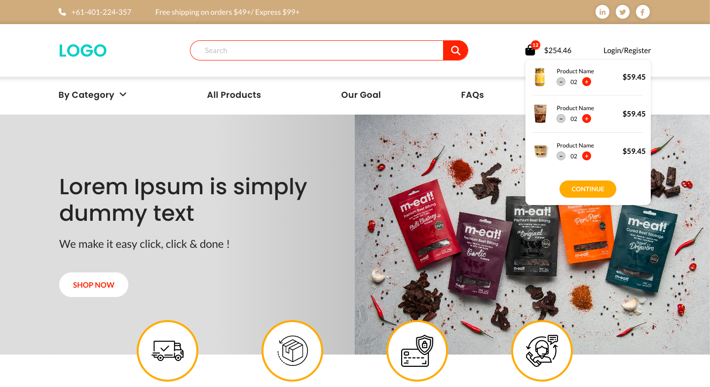

# Shophify Website (Clone)
Made responsive desktop version of an e-commerce site.

Home Page: <a href="https://shopify-website-srishti.onrender.com/">\(View Live Version\)</a>   <a href="https://github.com/itsmesrishti/creatiwise-assignment/blob/main/index.html">\(Link to Solution\)</a>

Product Page (_in progress_): <a href="https://creatiwise-product-page.onrender.com/">\(View Live Version\)</a>   <a href="https://github.com/itsmesrishti/creatiwise-assignment/blob/main/product-page/index.html">\(Link to Solution\)</a>

&nbsp;
## Challenge:
Create clone of the desktop version of the Shopify website. Should be fully responsive. 

&nbsp;
## Built With
- [HTML](https://developer.mozilla.org/en-US/docs/Web/HTML)
- [CSS](https://developer.mozilla.org/en-US/docs/Web/CSS)

&nbsp;
## Acknowledgements
- [Render](https://render.com/) for hosting
- [Font Awesome](https://fontawesome.com/) for the icons
- [Freepik](https://www.freepik.com/) for the images
